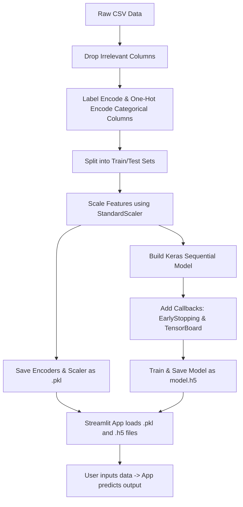

# Lesson 11: Artificial Neural Network (ANN) Project Cheatsheet

A quick reference guide for preparing tabular data, building, compiling, training a sequential ANN model in Keras, and deploying it with Streamlit.

## Libraries Needed
*   **Pandas** (`pandas`): Data loading and cleaning.
*   **Scikit-Learn** (`sklearn`): Encoding categorical features and scaling numeric variables.
*   **TensorFlow/Keras** (`tensorflow`): Building the neural network model, optimizers, losses, and callbacks.
*   **Pickle** (`pickle`): Serializing encoders/scalers.
*   **Streamlit** (`streamlit`): Front-end web deployment.

---

## 1. Project Workflow Diagram
Here is the end-to-end pipeline from raw data to a deployed Streamlit web application.



---

## 2. Data Preprocessing & Encoding (Scikit-Learn)
We clean the data, encode text categories to numbers, and scale the features.

```python
import pandas as pd
from sklearn.model_selection import train_test_split
from sklearn.preprocessing import LabelEncoder, OneHotEncoder, StandardScaler
import pickle

# Load dataset
df = pd.read_csv("Churn_Modelling.csv")
df = df.drop(['RowNumber', 'CustomerId', 'Surname'], axis=1) # Drop identifier columns

# Label Encoding (binary classes like Gender)
label_encoder_gender = LabelEncoder()
df['Gender'] = label_encoder_gender.fit_transform(df['Gender']) # Female/Male -> 0/1

# One-Hot Encoding (multi-class categories like Geography)
ohe_geo = OneHotEncoder()
geo_encoded = ohe_geo.fit_transform(df[['Geography']]).toarray()
geo_df = pd.DataFrame(geo_encoded, columns=ohe_geo.get_feature_names_out(['Geography']))
df = pd.concat([df.drop('Geography', axis=1), geo_df], axis=1) # Merge back

# Split Features & Target
X = df.drop('Exited', axis=1)
y = df['Exited']
X_train, X_test, y_train, y_test = train_test_split(X, y, test_size=0.2, random_state=42)

# Feature Scaling (mandatory for Neural Networks to converge fast)
scaler = StandardScaler()
X_train = scaler.fit_transform(X_train)
X_test = scaler.transform(X_test)

# Save the preprocessing objects for deployment
with open('scaler.pkl', 'wb') as f: pickle.dump(scaler, f)
with open('label_encoder_gender.pkl', 'wb') as f: pickle.dump(label_encoder_gender, f)
with open('one_hot_encoder_geo.pkl', 'wb') as f: pickle.dump(ohe_geo, f)
```

---

## 3. Building and Training the ANN (Keras)
We define the neural network layers, compile with an optimizer and loss function, add callbacks, and train.

```python
import tensorflow as tf
from tensorflow.keras.models import Sequential
from tensorflow.keras.layers import Dense
from tensorflow.keras.callbacks import EarlyStopping, TensorBoard
import datetime

# 1. Define Model Architecture
model = Sequential([
    Dense(64, activation='relu', input_shape=(X_train.shape[1],)),  # Hidden Layer 1 + Input Layer
    Dense(32, activation='relu'),                                   # Hidden Layer 2
    Dense(1, activation='sigmoid')                                  # Output (0 to 1 probability)
])

# 2. Compile Model
opt = tf.keras.optimizers.Adam(learning_rate=0.01)
loss = tf.keras.losses.BinaryCrossentropy()
model.compile(optimizer=opt, loss=loss, metrics=['accuracy'])

# 3. Define Callbacks
# TensorBoard logging
log_dir = "logs/fit/" + datetime.datetime.now().strftime("%Y%m%d-%H%M%S")
tb_callback = TensorBoard(log_dir=log_dir, histogram_freq=1)

# Early Stopping (Stops training if validation loss stops improving to prevent overfitting)
es_callback = EarlyStopping(monitor='val_loss', patience=10, restore_best_weights=True)

# 4. Train Model
history = model.fit(
    X_train, y_train, 
    validation_data=(X_test, y_test), 
    epochs=100, 
    callbacks=[tb_callback, es_callback]
)

# 5. Save the trained model
model.save('model.h5')
```

---

## 4. Deployed Streamlit App Code (`app.py`)
This is how we load all the artifacts and build a user interface to make predictions on new data.

```python
import streamlit as st
import numpy as np
import pandas as pd
import tensorflow as tf
import pickle

# Load models and preprocessing objects
model = tf.keras.models.load_model('model.h5')
with open('scaler.pkl', 'rb') as f: scaler = pickle.load(f)
with open('label_encoder_gender.pkl', 'rb') as f: label_encoder_gender = pickle.load(f)
with open('one_hot_encoder_geo.pkl', 'rb') as f: ohe_geo = pickle.load(f)

st.title("Customer Churn Prediction")

# User inputs
geography = st.selectbox('Geography', ohe_geo.categories_[0])
gender = st.selectbox('Gender', label_encoder_gender.classes_)
age = st.slider('Age', 18, 100, 30)
balance = st.number_input('Balance', min_value=0.0, value=10000.0)
# ... collect other features: CreditScore, Tenure, NumOfProducts, HasCrCard, IsActiveMember, EstimatedSalary

# Prep input data (Match training structure exactly!)
input_data = pd.DataFrame({
    'CreditScore': [600],
    'Gender': [label_encoder_gender.transform([gender])[0]],
    'Age': [age],
    'Tenure': [3],
    'Balance': [balance],
    'NumOfProducts': [2],
    'HasCrCard': [1],
    'IsActiveMember': [1],
    'EstimatedSalary': [50000.0]
})

# One-hot encode Geography
geo_encoded = ohe_geo.transform([[geography]]).toarray()
geo_encoded_df = pd.DataFrame(geo_encoded, columns=ohe_geo.get_feature_names_out(['Geography']))
input_df = pd.concat([input_data, geo_encoded_df], axis=1)

# Scale
input_scaled = scaler.transform(input_df)

# Predict
prediction = model.predict(input_scaled)
prediction_proba = prediction[0][0]

st.write(f"Churn Probability: {prediction_proba:.2%}")
if prediction_proba > 0.5:
    st.danger("Customer is likely to exit.")
else:
    st.success("Customer is likely to stay.")
```
