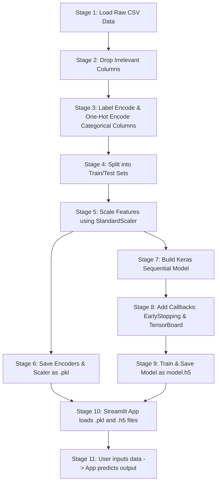

# Lesson 11: Artificial Neural Network (ANN) Project Cheatsheet

A quick reference guide for preparing tabular data, building, compiling, training a sequential ANN model in Keras, and deploying it with Streamlit.

## Core Libraries Needed
*   **Pandas** (`pandas`): Data loading and cleaning.
*   **Scikit-Learn** (`sklearn`): Encoding categorical features and scaling numeric variables.
*   **TensorFlow/Keras** (`tensorflow`): Building the neural network model, optimizers, losses, and callbacks.
*   **Pickle** (`pickle`): Serializing encoders/scalers.
*   **Streamlit** (`streamlit`): Front-end web deployment.

---

## 1. Project Workflow Diagram
Here is the end-to-end pipeline from raw data to a deployed Streamlit web application.



---

## 2. Workflow Stages Explained

### Stage 1: Load Raw CSV Data
Load your source tabular dataset into a Pandas DataFrame.
```python
import pandas as pd
df = pd.read_csv("Churn_Modelling.csv")
```

### Stage 2: Drop Irrelevant Columns
Remove IDs, names, or row numbers that don't help predict the target (e.g., whether a customer will exit/churn).
```python
df = df.drop(['RowNumber', 'CustomerId', 'Surname'], axis=1)
```

### Stage 3: Label Encode & One-Hot Encode Categorical Columns
Convert text strings to numbers.
*   **LabelEncoder**: Converts binary groups (like Gender: Female/Male) to `0` or `1`.
*   **OneHotEncoder**: Converts multi-class groups (like Geography: France, Spain, Germany) to separate binary columns.
```python
from sklearn.preprocessing import LabelEncoder, OneHotEncoder

# Binary Encode
label_encoder_gender = LabelEncoder()
df['Gender'] = label_encoder_gender.fit_transform(df['Gender'])

# Multi-class One-Hot Encode
ohe_geo = OneHotEncoder()
geo_encoded = ohe_geo.fit_transform(df[['Geography']]).toarray()
geo_df = pd.DataFrame(geo_encoded, columns=ohe_geo.get_feature_names_out(['Geography']))
df = pd.concat([df.drop('Geography', axis=1), geo_df], axis=1) # Drop original & merge encoded
```

### Stage 4: Split into Train/Test Sets
Divide your variables into features (`X` - input context) and target (`y` - column to predict), then split into train and test groups.
```python
from sklearn.model_selection import train_test_split

X = df.drop('Exited', axis=1)
y = df['Exited']

X_train, X_test, y_train, y_test = train_test_split(X, y, test_size=0.2, random_state=42)
```

### Stage 5: Scale Features using StandardScaler
Scale values so features with large numbers (like Salary or Balance) do not dominate features with small numbers (like Age or Tenure) during model training.
```python
from sklearn.preprocessing import StandardScaler

scaler = StandardScaler()
X_train = scaler.fit_transform(X_train)
X_test = scaler.transform(X_test)
```

### Stage 6: Save Encoders & Scaler as .pkl
Save your trained encoders and scaler as binary files using `pickle` so that you can reuse them to scale and encode new user inputs in your deployment script.
```python
import pickle

with open('scaler.pkl', 'wb') as f: pickle.dump(scaler, f)
with open('label_encoder_gender.pkl', 'wb') as f: pickle.dump(label_encoder_gender, f)
with open('one_hot_encoder_geo.pkl', 'wb') as f: pickle.dump(ohe_geo, f)
```

### Stage 7: Build Keras Sequential Model
Define your neural network architecture.
```python
import tensorflow as tf
from tensorflow.keras.models import Sequential
from tensorflow.keras.layers import Dense

# Model Structure
model = Sequential([
    Dense(64, activation='relu', input_shape=(X_train.shape[1],)),  # Hidden Layer 1 (connects to input)
    Dense(32, activation='relu'),                                   # Hidden Layer 2
    Dense(1, activation='sigmoid')                                  # Output Layer (yields probability 0 to 1)
])

# Compile model
opt = tf.keras.optimizers.Adam(learning_rate=0.01)
loss = tf.keras.losses.BinaryCrossentropy()
model.compile(optimizer=opt, loss=loss, metrics=['accuracy'])
```

### Stage 8: Add Callbacks: EarlyStopping & TensorBoard
Configure callbacks to monitor training:
*   **TensorBoard**: Stores log statistics to visualize learning curves.
*   **EarlyStopping**: Halts training if validation performance stops improving, saving model weights.
```python
from tensorflow.keras.callbacks import EarlyStopping, TensorBoard
import datetime

# TensorBoard Callback
log_dir = "logs/fit/" + datetime.datetime.now().strftime("%Y%m%d-%H%M%S")
tb_callback = TensorBoard(log_dir=log_dir, histogram_freq=1)

# Early Stopping Callback
es_callback = EarlyStopping(monitor='val_loss', patience=10, restore_best_weights=True)
```

### Stage 9: Train & Save Model as model.h5
Fit your model to the training data and save the final neural network configuration.
```python
history = model.fit(
    X_train, y_train, 
    validation_data=(X_test, y_test), 
    epochs=100, 
    callbacks=[tb_callback, es_callback]
)

# Save model weights and configuration
model.save('model.h5')
```

### Stage 10: Streamlit App loads .pkl and .h5 files
In your Streamlit file (`app.py`), reload the saved model and preprocessing parameters.
```python
import streamlit as st
import tensorflow as tf
import pickle

# Load models and preprocessing objects
model = tf.keras.models.load_model('model.h5')
with open('scaler.pkl', 'rb') as f: scaler = pickle.load(f)
with open('label_encoder_gender.pkl', 'rb') as f: label_encoder_gender = pickle.load(f)
with open('one_hot_encoder_geo.pkl', 'rb') as f: ohe_geo = pickle.load(f)
```

### Stage 11: User inputs data -> App predicts output
Build the UI inputs, match incoming formats to training inputs, pre-process them, and call model prediction.
```python
# UI Inputs
geography = st.selectbox('Geography', ohe_geo.categories_[0])
gender = st.selectbox('Gender', label_encoder_gender.classes_)
age = st.slider('Age', 18, 100, 30)
balance = st.number_input('Balance', min_value=0.0, value=10000.0)
# ... gather all other variables (CreditScore, Tenure, NumOfProducts, HasCrCard, IsActiveMember, EstimatedSalary)

# Create input DataFrame
input_data = pd.DataFrame({
    'CreditScore': [600],
    'Gender': [label_encoder_gender.transform([gender])[0]],
    'Age': [age],
    'Tenure': [3],
    'Balance': [balance],
    'NumOfProducts': [2],
    'HasCrCard': [1],
    'IsActiveMember': [1],
    'EstimatedSalary': [50000.0]
})

# Encodes & Scales custom input matching X_train schema
geo_encoded = ohe_geo.transform([[geography]]).toarray()
geo_encoded_df = pd.DataFrame(geo_encoded, columns=ohe_geo.get_feature_names_out(['Geography']))
input_df = pd.concat([input_data, geo_encoded_df], axis=1)
input_scaled = scaler.transform(input_df)

# Run Inference
prediction = model.predict(input_scaled)
probability = prediction[0][0]

st.write(f"Churn Probability: {probability:.2%}")
if probability > 0.5:
    st.danger("Customer is likely to exit.")
else:
    st.success("Customer is likely to stay.")
```
