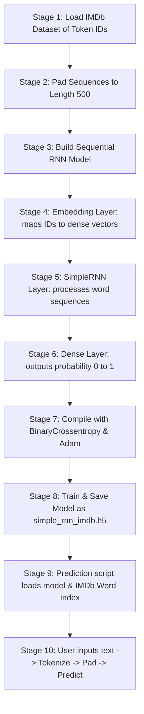

# Lesson 12: Simple RNN Sentiment Analysis Cheatsheet

A quick reference guide for building, compiling, training a Recurrent Neural Network (RNN) in Keras for movie review sentiment analysis, and predicting on custom user text.

## Core Libraries Needed
*   **TensorFlow/Keras** (`tensorflow`): IMDB dataset, `pad_sequences` for uniform length, `Embedding`, `SimpleRNN`, and `Dense` layers, callbacks, and model saving/loading.
*   **Numpy** (`numpy`): Transforming lists into array structures.

---

## 1. Project Workflow Diagram
Below is the end-to-end pipeline from pre-tokenized review arrays to sentiment predictions.



---

## 2. Workflow Stages Explained

### Stage 1: Load IMDb Dataset of Token IDs
The IMDb dataset is pre-converted into sequences of integers representing words. We limit the vocabulary size to the 10,000 most common words.
```python
from tensorflow.keras.datasets import imdb

max_features = 10000 # Limit vocabulary
(x_train, y_train), (x_test, y_test) = imdb.load_data(num_words=max_features)
```

### Stage 2: Pad Sequences to Length 500
Make reviews the same length. Shorter reviews are filled with `0`s (padded), and longer ones are cut off (truncated).
```python
from tensorflow.keras.preprocessing import sequence

max_len = 500
x_train = sequence.pad_sequences(x_train, maxlen=max_len)
x_test = sequence.pad_sequences(x_test, maxlen=max_len)
```

### Stage 3: Build Sequential RNN Model
Instantiate the `Sequential` model constructor.
```python
from tensorflow.keras.models import Sequential
model = Sequential()
```

### Stage 4: Embedding Layer: maps IDs to dense vectors
Add the `Embedding` layer. This maps each word index to a dense vector (e.g. size 128) representing contextual meanings.
```python
from tensorflow.keras.layers import Embedding, Input

model.add(Input(shape=(max_len,))) # Input layer with length of 500
model.add(Embedding(input_dim=max_features, output_dim=128))
```

### Stage 5: SimpleRNN Layer: processes word sequences
Add a `SimpleRNN` layer to read and evaluate the input sequence step-by-step.
```python
from tensorflow.keras.layers import SimpleRNN

model.add(SimpleRNN(128, activation='relu'))
```

### Stage 6: Dense Layer: outputs probability 0 to 1
Add a fully-connected output layer with a sigmoid function to return a binary score (negative/positive sentiment).
```python
from tensorflow.keras.layers import Dense

model.add(Dense(1, activation='sigmoid'))
```

### Stage 7: Compile with BinaryCrossentropy & Adam
Choose the loss metric and optimizer to teach the model.
```python
model.compile(optimizer='adam', loss='binary_crossentropy', metrics=['accuracy'])
```

### Stage 8: Train & Save Model as simple_rnn_imdb.h5
Fit the model to dataset observations and save.
```python
from tensorflow.keras.callbacks import EarlyStopping

# Setup Early Stopping to prevent overfitting
es = EarlyStopping(monitor='val_loss', patience=3, restore_best_weights=True)

# Train the model
model.fit(
    x_train, y_train, 
    epochs=10, 
    batch_size=64, 
    validation_split=0.2, 
    callbacks=[es]
)

# Save model
model.save('simple_rnn_imdb.h5')
```

### Stage 9: Prediction script loads model & IMDb Word Index
During deployment, reload your saved model and retrieve the dictionary that IMDb uses to map strings to integer IDs.
```python
import tensorflow as tf
from tensorflow.keras.datasets import imdb

# Load model and word index
model = tf.keras.models.load_model('simple_rnn_imdb.h5')
word_index = imdb.get_word_index()
```

### Stage 10: User inputs text -> Tokenize -> Pad -> Predict
Convert raw user strings to integer tokens, pad them, and run predictions.
```python
from tensorflow.keras.preprocessing import sequence

# Helper function to tokenize and encode user text
def encode_user_text(raw_text, max_len=500):
    words = raw_text.lower().split()
    
    # IMDb uses a special index mapping with shift of 3:
    # 0 = padding, 1 = start character, 2 = OOV (out of vocabulary)
    encoded = [1] # Start token
    for word in words:
        index = word_index.get(word, -3) + 3 # Shift by 3
        if index < max_features:
            encoded.append(index)
        else:
            encoded.append(2) # Map to OOV
            
    # Pad sequence
    padded = sequence.pad_sequences([encoded], maxlen=max_len)
    return padded

# Run prediction
user_text = "The acting was incredible and the plot was engaging!"
preprocessed_input = encode_user_text(user_text)
prediction = model.predict(preprocessed_input)
score = prediction[0][0]

print(f"Positive Sentiment Probability: {score:.2%}")
if score > 0.5:
    print("Sentiment: Positive Review 👍")
else:
    print("Sentiment: Negative Review 👎")
```
