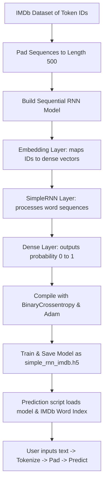

# Lesson 12: Simple RNN Sentiment Analysis Cheatsheet

A quick reference guide for building, compiling, training a Recurrent Neural Network (RNN) in Keras for movie review sentiment analysis, and predicting on custom user text.

## Libraries Needed
*   **TensorFlow/Keras** (`tensorflow`): IMDB dataset, `pad_sequences` for uniform length, `Embedding`, `SimpleRNN`, and `Dense` layers, callbacks, and model saving/loading.
*   **Numpy** (`numpy`): Transforming lists into array structures.

---

## 1. Project Workflow Diagram
Below is the end-to-end pipeline from pre-tokenized review arrays to sentiment predictions.



---

## 2. Text Preparation & Padding (Pre-tokenized IMDb)
The IMDb dataset is pre-converted into sequences of integers. We load it and pad it so every review has exactly the same length.

```python
from tensorflow.keras.datasets import imdb
from tensorflow.keras.preprocessing import sequence

# Load IMDb dataset (limiting vocabulary to the 10,000 most common words)
max_features = 10000
(x_train, y_train), (x_test, y_test) = imdb.load_data(num_words=max_features)

# Pad sequences (reviews shorter than 500 words get padded with 0s; longer reviews are truncated)
max_len = 500
x_train = sequence.pad_sequences(x_train, maxlen=max_len)
x_test = sequence.pad_sequences(x_test, maxlen=max_len)
```

---

## 3. Creating & Training the Simple RNN Model
An RNN has two crucial layers for NLP:
*   **`Embedding`**: Turns integer indices (e.g. `14`) into dense, multi-dimensional vectors (e.g., shape 128) capturing semantic meanings.
*   **`SimpleRNN`**: A recurrent layer that reads the word vectors sequentially, passing information from one step to the next to keep "memory".

```python
from tensorflow.keras.models import Sequential
from tensorflow.keras.layers import Embedding, SimpleRNN, Dense, Input
from tensorflow.keras.callbacks import EarlyStopping

model = Sequential([
    Input(shape=(max_len,)),                              # Inputs are padded sequences of length 500
    Embedding(input_dim=max_features, output_dim=128),     # Maps 10k vocab words to 128-dimensional dense vectors
    SimpleRNN(128, activation='relu'),                     # Simple RNN layer with 128 hidden units
    Dense(1, activation='sigmoid')                        # Output Layer: predicts positive (1) or negative (0)
])

# Compile model
model.compile(optimizer='adam', loss='binary_crossentropy', metrics=['accuracy'])

# Early stopping callback
es = EarlyStopping(monitor='val_loss', patience=3, restore_best_weights=True)

# Train model
model.fit(x_train, y_train, epochs=10, batch_size=64, validation_split=0.2, callbacks=[es])
model.save('simple_rnn_imdb.h5')
```

---

## 4. Predicting Sentiment on Custom Text
When predicting on a new, raw string (like `"The movie was fantastic!"`), we must convert the words to indices using IMDb's original word index before feeding it to the model.

```python
import tensorflow as tf
from tensorflow.keras.datasets import imdb
from tensorflow.keras.preprocessing import sequence

# Load model
model = tf.keras.models.load_model('simple_rnn_imdb.h5')

# Get IMDb's word dictionary mapping
word_index = imdb.get_word_index()

# Helper function to tokenize and encode user text
def encode_user_text(raw_text, max_len=500):
    words = raw_text.lower().split()
    
    # IMDb uses a special index mapping index shift of 3:
    # 0 = padding, 1 = start character, 2 = OOV (out of vocabulary), 3 = unused
    encoded = [1] # Start token
    for word in words:
        # Get index from vocabulary, shift by 3. Use 2 (OOV) if word not in vocabulary
        index = word_index.get(word, -3) + 3
        if index < max_features:
            encoded.append(index)
        else:
            encoded.append(2) # Map to OOV
            
    # Pad sequence
    padded = sequence.pad_sequences([encoded], maxlen=max_len)
    return padded

# Predict
user_text = "I absolutely loved this movie! The acting was incredible and the plot was engaging."
preprocessed_input = encode_user_text(user_text)

prediction = model.predict(preprocessed_input)
score = prediction[0][0]

print(f"Positive Sentiment Probability: {score:.2%}")
if score > 0.5:
    print("Sentiment: Positive Review 👍")
else:
    print("Sentiment: Negative Review 👎")
```
