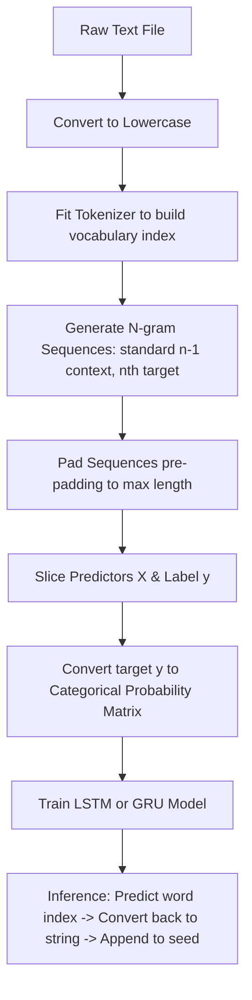

# Lesson 13: Next Word Prediction (LSTM & GRU) Cheatsheet

A quick reference guide for preprocessing raw text into n-grams, padding them, and building LSTM or GRU networks in Keras to predict the next word.

## Libraries Needed
*   **TensorFlow/Keras** (`tensorflow`): `Tokenizer` for word mapping, `pad_sequences` for equal length, `to_categorical` for target encoding, `LSTM`, `GRU`, and `Dense` layers.
*   **Numpy** (`numpy`): Converting sequence arrays.

---

## 1. Project Workflow Diagram
Below is the end-to-end data pipeline and model workflow for next-word generation.



---

## 2. Data Preprocessing Pipeline (Recall)
Preparing raw text into features `X` (context words) and labels `y` (target next-word).

```python
import numpy as np
import tensorflow as tf
from tensorflow.keras.preprocessing.text import Tokenizer
from tensorflow.keras.preprocessing.sequence import pad_sequences

# 1. Load data
with open('hamlet.txt', 'r') as file:
    text = file.read().lower()

# 2. Tokenize (words -> integer IDs)
tokenizer = Tokenizer()
tokenizer.fit_on_texts([text])
total_words = len(tokenizer.word_index) + 1  # +1 for 0-padding token

# 3. Create N-gram sequences
input_sequences = []
for line in text.split('\n'):
    token_list = tokenizer.texts_to_sequences([line])[0]
    for i in range(1, len(token_list)):
        n_gram_sequence = token_list[:i+1] # Progressive n-grams
        input_sequences.append(n_gram_sequence)

# 4. Pad sequences to the longest sequence length
max_sequence_len = max([len(x) for x in input_sequences])
input_sequences = np.array(pad_sequences(input_sequences, maxlen=max_sequence_len, padding='pre'))

# 5. Split features (X) and labels (y)
# X: all rows, all columns except the last one
# y: all rows, only the last column
X, y = input_sequences[:, :-1], input_sequences[:, -1]

# 6. One-hot encode labels (Categorize)
y = tf.keras.utils.to_categorical(y, num_classes=total_words)
```

---

## 3. Building LSTM and GRU Models
LSTMs and GRUs are types of Recurrent Neural Networks designed to capture long-term context and dependency in text sequences.

```python
from tensorflow.keras.models import Sequential
from tensorflow.keras.layers import Embedding, LSTM, GRU, Dense

# ---- Option A: LSTM Model ----
lstm_model = Sequential([
    Embedding(total_words, 100, input_length=max_sequence_len-1), # Input length is max_sequence_len minus the label column
    LSTM(150),                                                    # LSTM unit with 150 memory cells
    Dense(total_words, activation='softmax')                      # Outputs probability list across vocabulary
])
lstm_model.compile(loss='categorical_crossentropy', optimizer='adam', metrics=['accuracy'])


# ---- Option B: GRU Model ----
# GRU is a streamlined version of LSTM. It is faster to train and uses less memory.
gru_model = Sequential([
    Embedding(total_words, 100, input_length=max_sequence_len-1),
    GRU(150),                                                     # GRU unit
    Dense(total_words, activation='softmax')
])
gru_model.compile(loss='categorical_crossentropy', optimizer='adam', metrics=['accuracy'])
```

---

## 4. Word Generation Loop (Inference)
To generate sentences, we feed a starting "seed" text to the model, predict the next word, append it to the seed, and repeat the process.

```python
def predict_next_words(seed_text, next_words_count=5):
    for _ in range(next_words_count):
        # 1. Convert seed text to sequence of integers
        token_list = tokenizer.texts_to_sequences([seed_text])[0]
        
        # 2. Pad to match the model's expected input shape
        token_list = pad_sequences([token_list], maxlen=max_sequence_len-1, padding='pre')
        
        # 3. Predict probabilities and find the index with the highest probability
        predicted_probs = lstm_model.predict(token_list, verbose=0)
        predicted_index = np.argmax(predicted_probs, axis=-1)[0]
        
        # 4. Map the index back to its string word
        output_word = ""
        for word, index in tokenizer.word_index.items():
            if index == predicted_index:
                output_word = word
                break
                
        # 5. Append the word to the seed text
        seed_text += " " + output_word
        
    return seed_text

# Example execution
print(predict_next_words("To be or not", next_words_count=3))
# Expected Output: "To be or not to be"
```
