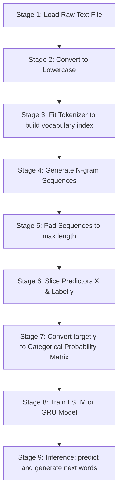

# Lesson 13: Next Word Prediction (LSTM & GRU) Cheatsheet

A quick reference guide for preprocessing raw text into n-grams, padding them, and building LSTM or GRU networks in Keras to predict the next word.

## Core Libraries Needed
*   **TensorFlow/Keras** (`tensorflow`): `Tokenizer` for word mapping, `pad_sequences` for equal length, `to_categorical` for target encoding, `LSTM`, `GRU`, and `Dense` layers.
*   **Numpy** (`numpy`): Converting sequence arrays.

---

## 1. Project Workflow Diagram
Below is the end-to-end data pipeline and model workflow for next-word generation.



---

## 2. Workflow Stages Explained

### Stage 1: Load Raw Text File
Read the source document file that will be used to train the language model.
```python
with open('hamlet.txt', 'r') as file:
    text = file.read()
```

### Stage 2: Convert to Lowercase
Standardize capitalization so the vocabulary model treats words like "The" and "the" as identical, reducing complexity.
```python
text = text.lower()
```

### Stage 3: Fit Tokenizer to build vocabulary index
Build a lookup index where every unique word gets mapped to a unique number.
```python
from tensorflow.keras.preprocessing.text import Tokenizer

tokenizer = Tokenizer()
tokenizer.fit_on_texts([text])
total_words = len(tokenizer.word_index) + 1  # Add 1 to account for 0-padding
```

### Stage 4: Generate N-gram Sequences
Split the text by sentences, convert words to numbers, and generate sliding phrases.
If a sentence has tokens `[A, B, C, D]`, this creates: `[A, B]`, `[A, B, C]`, and `[A, B, C, D]`.
```python
input_sequences = []

# Split sentences
for line in text.split('\n'):
    token_list = tokenizer.texts_to_sequences([line])[0]
    
    # Generate progressive subsets
    for i in range(1, len(token_list)):
        n_gram_sequence = token_list[:i+1] # Slice from start to index i+1
        input_sequences.append(n_gram_sequence)
```

### Stage 5: Pad Sequences to max length
Pad shorter phrases with zeros at the beginning (`'pre'`) so all sequences match the length of the longest sentence in your dataset.
```python
from tensorflow.keras.preprocessing.sequence import pad_sequences
import numpy as np

# Find longest sequence
max_sequence_len = max([len(x) for x in input_sequences])

# Apply pre-padding
input_sequences = np.array(pad_sequences(input_sequences, maxlen=max_sequence_len, padding='pre'))
```

### Stage 6: Slice Predictors X & Label y
Using NumPy slicing, divide the padded matrix:
*   **Features (`X`)**: Every column except the last one (context words).
*   **Target (`y`)**: Only the very last column (the word that comes next).
```python
# X = all rows, up to last column
X = input_sequences[:, :-1]

# y = all rows, only the last column
y = input_sequences[:, -1]
```

### Stage 7: Convert target y to Categorical Probability Matrix
One-hot encode `y` into a categorical grid of `0`s and `1`s.
```python
import tensorflow as tf

y = tf.keras.utils.to_categorical(y, num_classes=total_words)
```

### Stage 8: Train LSTM or GRU Model
Build and train the model using recurrent layers.
```python
from tensorflow.keras.models import Sequential
from tensorflow.keras.layers import Embedding, LSTM, GRU, Dense

# Option A: LSTM Structure
model = Sequential([
    Embedding(total_words, 100, input_length=max_sequence_len-1),
    LSTM(150),
    Dense(total_words, activation='softmax') # Softmax outputs probability over all words
])

model.compile(loss='categorical_crossentropy', optimizer='adam', metrics=['accuracy'])
model.fit(X, y, epochs=100, verbose=1)
```

### Stage 9: Inference: predict and generate next words
Pass a seed sentence to the trained model, grab the word index with the highest probability, decode it back to a string, append it to the seed, and repeat.
```python
def predict_next_words(seed_text, next_words_count=5):
    for _ in range(next_words_count):
        # 1. Convert seed to integer list
        token_list = tokenizer.texts_to_sequences([seed_text])[0]
        
        # 2. Pre-pad list to match training input length
        token_list = pad_sequences([token_list], maxlen=max_sequence_len-1, padding='pre')
        
        # 3. Predict output word index
        predicted_probs = model.predict(token_list, verbose=0)
        predicted_index = np.argmax(predicted_probs, axis=-1)[0]
        
        # 4. Find the word matching the index
        output_word = ""
        for word, index in tokenizer.word_index.items():
            if index == predicted_index:
                output_word = word
                break
                
        # 5. Append and continue
        seed_text += " " + output_word
        
    return seed_text

# Predict next 3 words after "To be or not"
print(predict_next_words("To be or not", next_words_count=3))
```
