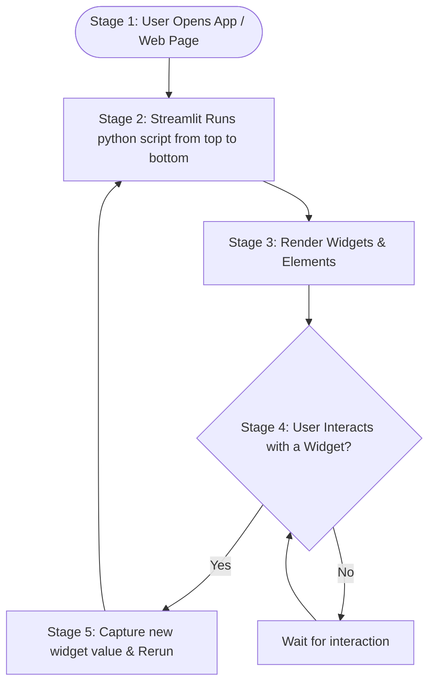

# Lesson 9: Streamlit Cheatsheet

A quick reference guide for building web applications using Streamlit, structured directly around the Streamlit execution workflow.

## Core Libraries Needed
*   **Library**: `streamlit` (typically imported as `st`)
*   **Data Processing**: `pandas`, `numpy` (for displaying data and charts)

---

## 1. Streamlit Execution Model (Workflow Diagram)



---

## 2. Workflow Stages Explained

### Stage 1: User Opens App / Web Page (App Launch)
To launch the application, you write your code in a `.py` file and run the launch command in your terminal.

```bash
# Run this command in your terminal to start the server and open the web page
streamlit run app.py
```

### Stage 2: Streamlit Runs python script from top to bottom
Every single line of code in your file is executed from first line to last line. There is no event listener; execution is simple and sequential.
```python
import streamlit as st
import pandas as pd
import numpy as np

# Any setup calculations go here and run from top to bottom
print("This line will print in your terminal every time the page loads or re-runs!")
```

### Stage 3: Render Widgets & Elements
Streamlit displays text, data, and layout widgets sequentially as it reads down your script.

```python
# 1. Renders Title & Text
st.title("My Streamlit App")
st.write("This renders text or data frames to the UI.")

# 2. Renders Interactive DataFrame
df = pd.DataFrame({
    'first column': [1, 2, 3, 4],
    'second column': [10, 20, 30, 40]
})
st.write(df)

# 3. Renders Visual Charts
chart_data = pd.DataFrame(
    np.random.randn(20, 3),
    columns=['a', 'b', 'c']
)
st.line_chart(chart_data)
```

### Stage 4: User Interacts with a Widget?
You render input elements that users can change. When they interact, the status changes.

```python
# Renders a text box and slider. The app stops here and waits for user interaction.
name = st.text_input("Enter your name:")
age = st.slider("Select your age:", 0, 100, 25)
choice = st.selectbox("Choose language:", ["Python", "Java", "C++"])
uploaded_file = st.file_uploader("Choose a CSV file:", type="csv")
```

### Stage 5: Capture new widget value & Rerun
Once the user types a name or moves a slider, Streamlit captures that input value, assigns it to your Python variables, and **re-runs the entire script from top to bottom** to update the display.

```python
# If the user entered their name, it is captured, and this block prints Hello.
if name:
    st.write(f"Hello, {name}!")

# Displays the captured slider value
st.write(f"Your selected age is {age}")

# Processes the uploaded file and updates the table on rerun
if uploaded_file is not None:
    uploaded_df = pd.read_csv(uploaded_file)
    st.write(uploaded_df)
```
