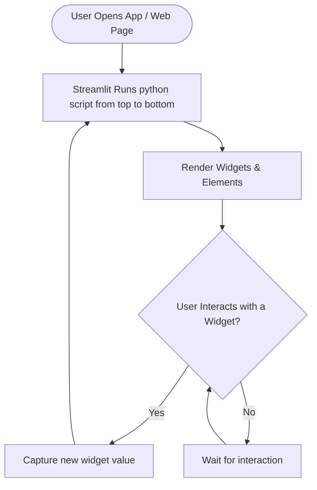

# Lesson 9: Streamlit Cheatsheet

A quick reference guide for building web applications using Streamlit, including standard widgets, data plotting, and the run cycle.

## Core Concepts & Built-ins
To use this framework, you need to install and import Streamlit.

*   **Library**: `streamlit` (typically imported as `st`)
*   **Run command**: `streamlit run app.py` (executed from terminal)

---

## 1. Streamlit Execution Model (Workflow Diagram)
Streamlit uses a unique execution model. The entire Python script runs **from top to bottom** every time a user interacts with any widget (clicks, slides, types).



---

## 2. Text and Display Widgets
Used to write titles, headers, and standard text or dataframes.

```python
import streamlit as st
import pandas as pd

# Title & Text
st.title("My First Web App")
st.write("This is standard text. You can pass strings, HTML, dataframes, or charts to st.write!")

# Rendering DataFrames
df = pd.DataFrame({
    'col1': [1, 2, 3],
    'col2': [10, 20, 30]
})
st.write(df)  # Renders as an interactive table
```

---

## 3. Interactive Inputs (Widgets)
Widgets capture user inputs and return them as Python variables.

```python
# 1. Text Input
name = st.text_input("Enter your name:")
if name:
    st.write(f"Hello, {name}!")

# 2. Slider (label, min_val, max_val, default_val)
age = st.slider("Select your age:", 0, 100, 25)
st.write(f"Your age is {age}")

# 3. Select Box (Dropdown menu)
options = ["Python", "Java", "C++"]
choice = st.selectbox("Choose a programming language:", options)
st.write(f"You selected {choice}")
```

---

## 4. File Uploads
Allows users to upload files (CSV, images, etc.) from their local machine.

```python
# File Uploader widget
uploaded_file = st.file_uploader("Choose a CSV file:", type="csv")

if uploaded_file is not None:
    # Read the uploaded CSV directly into Pandas
    df = pd.read_csv(uploaded_file)
    st.write("Uploaded DataFrame:")
    st.write(df)
```

---

## 5. Visualizing Charts
Streamlit has native chart support that automatically binds to Pandas dataframes.

```python
import numpy as np

# Create random chart data
chart_data = pd.DataFrame(
    np.random.randn(20, 3),
    columns=['a', 'b', 'c']
)

# Render interactive line chart
st.line_chart(chart_data)
```
